# Jarkom-Modul-1-ITB03-2022

## Soal 1
Sebutkan web server yang digunakan pada "monta.if.its.ac.id"! 

### Jawab soal 1
Filter: http.host==monta.if.its.ac.id

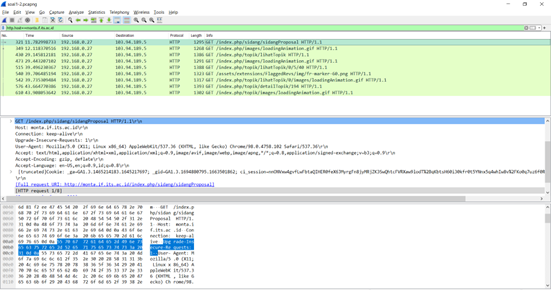

Follow HTTP Stream:

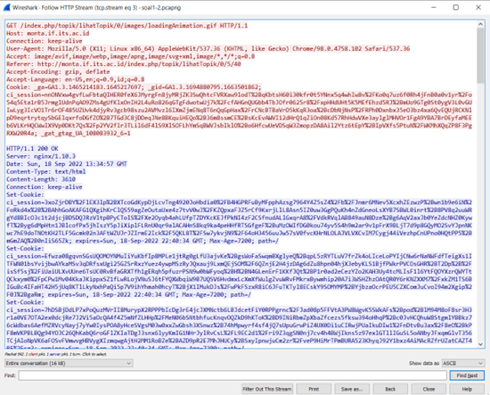

`Server: nginx/1.10.3`

## Soal 2
Ishaq sedang bingung mencari topik ta untuk semester ini , lalu ia datang ke website monta dan menemukan detail topik pada website “monta.if.its.ac.id” , judul TA apa yang dibuka oleh ishaq ?

### Jawab soal 2
Filter: frame contains "detail"

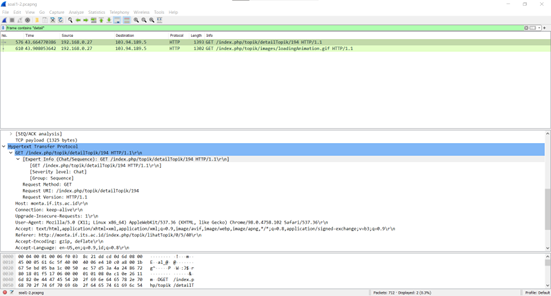

Kemudian, kami membuka google dan mencari sesuai dengan referer yang diberikan yaitu http://monta.if.its.ac.id/index.php/topik/detailTopik/194 dan mendapat judul TA yang sedang dibuka yaitu Evaluasi unjuk kerja User Space Filesystem (FUSE)

## Soal 3
Filter sehingga wireshark hanya menampilkan paket yang menuju port 80! 

### Jawab soal 3
lakukan filter dengan mengetikan: tcp.dstport == 80 || udp.dstport == 80

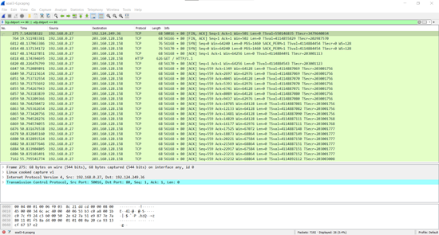

## Soal 4
Filter sehingga wireshark hanya mengambil paket yang berasal dari port 21!

### Jawab soal 4
Filter: tcp.srcport == 21 || udp.srcport == 21

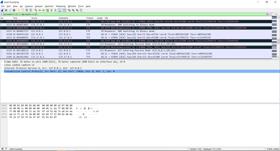

## Soal 5
Filter sehingga wireshark hanya mengambil paket yang berasal dari port 443

### Jawab soal 5
Filter: tcp.srcport == 443 || udp.srcport == 443

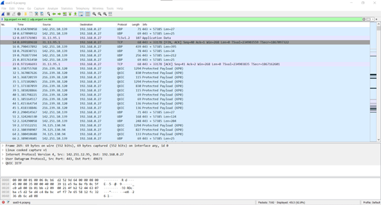

## Soal 6
Filter sehingga wireshark hanya menampilkan paket yang menuju ke lipi.go.id !

### Jawab soal 6
Filter: http.host==lipi.go.id

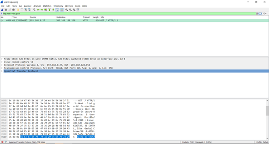

## Soal 7
Filter sehingga wireshark hanya mengambil paket yang berasal dari ip kalian

### Jawab soal 7
Lakukan perintah ipconfig terlebih dahulu untuk mengetahui ip kita.

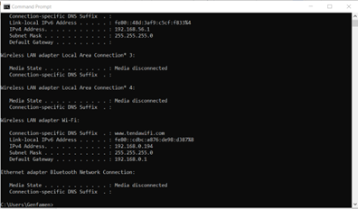

Setelah itu mendapat ip kita yaitu 192.168.0.194

Filter: src host  192.168.0.194.

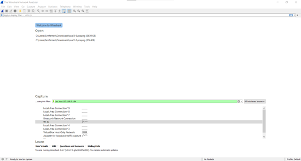

Dan untuk hasilnya yaitu sebagai berikut:

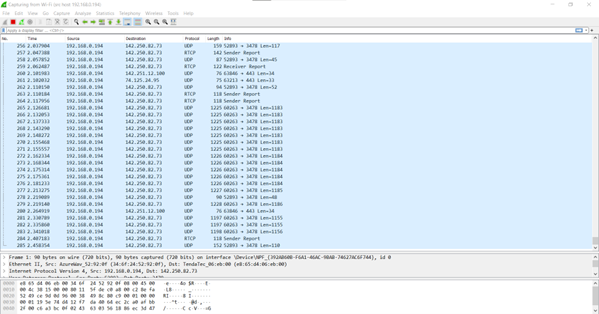

## Soal 8
Telusuri aliran paket dalam file .pcap yang diberikan, cari informasi berguna berupa percakapan antara dua mahasiswa terkait tindakan kecurangan pada kegiatan praktikum. Percakapan tersebut dilaporkan menggunakan protokol jaringan dengan tingkat keandalan yang tinggi dalam pertukaran datanya sehingga kalian perlu menerapkan filter dengan protokol yang tersebut.

### Jawab soal 8
Pertama, kami ingin mencari tahu percakapan antara dua mahasiswa tersebut dengan melakukan klik kanan dan mengklik follow pada TCP Stream, seperti berikut:

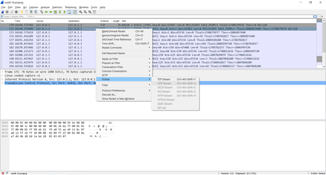

Kemudian setelah itu menggunakan show data ASCII dan melakukan Up pada Stream. Hingga mendapatkan percakapan-percakapan sebagai berikut: 

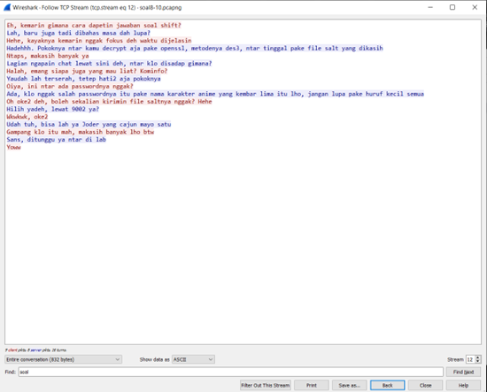

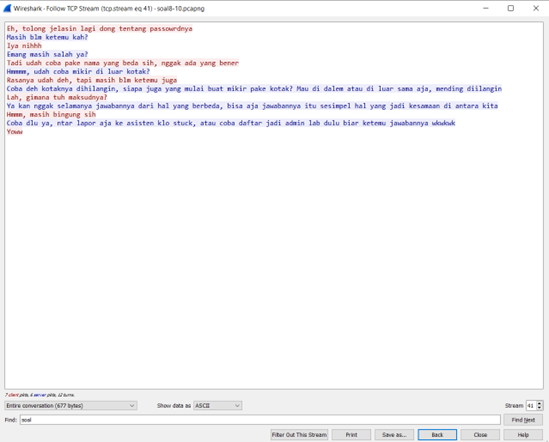

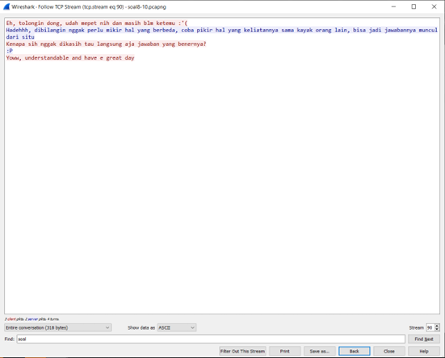

## Soal 9
Terdapat laporan adanya pertukaran file yang dilakukan oleh kedua mahasiswa dalam percakapan yang diperoleh, carilah file yang dimaksud! Untuk memudahkan laporan kepada atasan, beri nama file yang ditemukan dengan format [nama_kelompok].des3 dan simpan output file dengan nama “flag.txt”.

### Jawab soal 9
Dari percakapan di atas (Nomor 8) terdapat clue bahwa menggunakan openssl, des3, dan port 9002.

Filter: tcp.port == 9002

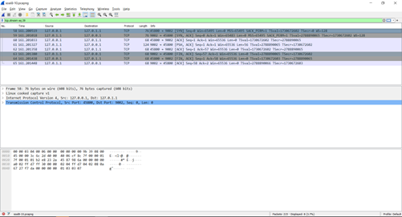

Lakukan Follow TCP Stream, kemudian terdapat tampilan sebagai berikut:

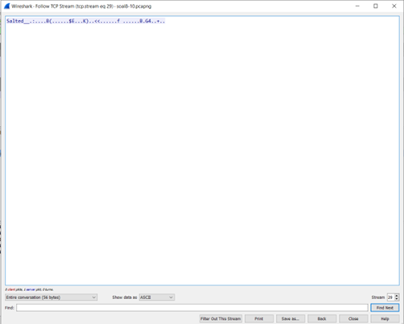

Simpan data tersebut dalam bentuk raw dengan nama ITB03.des3

Lakukan decrypt dengan menggunakan openssl dengan password “nakano” (nama keluarga dalam anime kembar lima) dan simpan file output dengan nama flag.txt

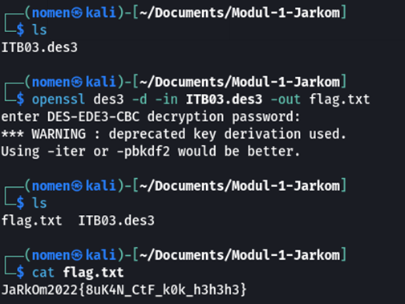

## Soal 10
Temukan password rahasia (flag) dari organisasi bawah tanah yang disebutkan di atas!

### Jawab soal 10
Flag: JaRkOm2022{8uK4N_CtF_k0k_h3h3h3}     

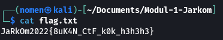

## Kendala Pengerjaan
Adapun kendala yang kami alami selama pengerjaan adalah sebagai berikut:
1. Dalam melakukan decyrpt des3 terdapat command yang kurang yaitu `- d` sehingga flag-nya tidak kami peroleh.
2. Dalam menyimpan raw dalam bentuk `.des3` seharusnya kami memberi ekstension tersebut setelah tersimpan dalam media, barulah diberi ekstension bukan pada saat melakukan save as.
